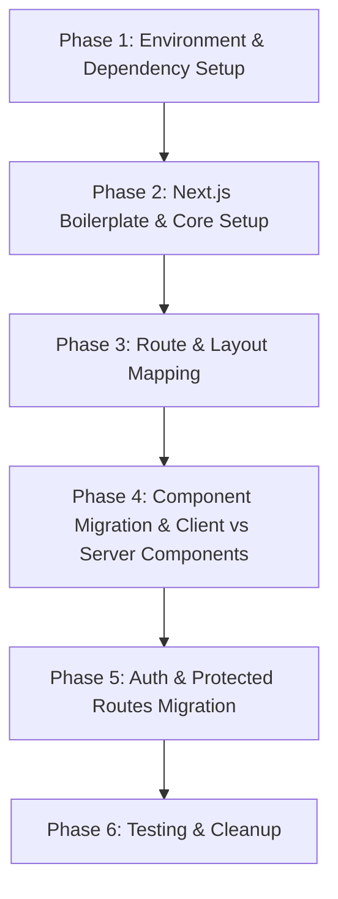

# Migration Plan: Vite React to Next.js (TypeScript)

This plan outlines the conversion of this project into a **Next.js App Router** project with **TypeScript**, focusing on preserving all existing layouts, features, Supabase integrations, and Tailwind v4 styling without breaking functionality.

---

## 🗺️ Migration Phases at a Glance



---

## 📋 Detailed Phases

### Phase 1: Environment & Dependency Setup
*   **Goal**: Prepare project files and update dependencies to support both systems during migration or completely switch over dependencies.
*   **Tasks**:
    1. Backup/branch the codebase (e.g., `git checkout -b feature/nextjs-migration`).
    2. Install Next.js and necessary types:
       ```bash
       npm install next@latest react@latest react-dom@latest
       ```
    3. Update scripts in `package.json` to use `next dev`, `next build`, and `next start`.
    4. Configure `tsconfig.json` for Next.js (Next.js automatically writes/modifies this when running `next dev`).

### Phase 2: Next.js Boilerplate & Core Config
*   **Goal**: Integrate Next.js config files and configure Tailwind CSS (v4) and global styles.
*   **Tasks**:
    1. Create a `next.config.ts` (or `.js`) configuration.
    2. Configure Tailwind CSS v4 in Next.js (ensuring `@tailwindcss/postcss` and PostCSS config is setup correctly, or use Next.js's built-in support).
    3. Create the root `app/` directory and configure the Root Layout (`app/layout.tsx`).
    4. Port global styles (`src/index.css`) into `app/globals.css`.

### Phase 3: Route & Layout Mapping
*   **Goal**: Replicate the `react-router-dom` routes into the directory-based App Router structure.
*   **Tasks**:
    *   `src/pages/Home.tsx` ➡️ `app/page.tsx`
    *   `src/pages/Auth/Auth.tsx` ➡️ `app/auth/page.tsx`
    *   `src/pages/TakeQuizInput.tsx` ➡️ `app/take/page.tsx`
    *   `src/pages/TakeQuiz.tsx` ➡️ `app/quiz/[quizId]/page.tsx`
    *   `src/pages/Results.tsx` ➡️ `app/results/page.tsx`
    *   `src/pages/Dashboard.tsx` ➡️ `app/dashboard/page.tsx`
    *   `src/pages/CreateQuiz.tsx` ➡️ `app/dashboard/create/page.tsx`
    *   `src/pages/Quizzes.tsx` ➡️ `app/dashboard/my-quizzes/page.tsx`
    *   Set up a nested layout (`app/dashboard/layout.tsx`) utilizing `DashboardLayout`.

### Phase 4: Component Migration (Client vs. Server)
*   **Goal**: Adapt components to run correctly under Next.js.
*   **Tasks**:
    1. Identify components that use client-side state/effects (e.g., `useState`, `useEffect`, interactive event handlers) and mark them with `"use client"`.
    2. Migrate hooks from React Router Dom (`useNavigate`, `useParams`, `useLocation`) to Next.js equivalents (`useRouter`, `useParams`, `usePathname`, `useSearchParams`).
    3. Replace standard `<a>` tags and React Router `<Link>` components with Next.js `<Link>` components.

### Phase 5: Auth & Protected Routes
*   **Goal**: Transition authentication states and route guards to Next.js standard patterns.
*   **Tasks**:
    1. Port/integrate the Supabase client helper logic.
    2. Adapt `RequireAuth` context/component to work on the client side or migrate to Next.js middleware-based route protection.
    3. Set up the `Toaster` provider within the Root Layout wrapper.

### Phase 6: Testing & Cleanup
*   **Goal**: Remove obsolete packages and verify production readiness.
*   **Tasks**:
    1. Uninstall `react-router-dom`, `@types/react-router-dom`, `@vitejs/plugin-react`, and `vite`.
    2. Clean up configuration files like `vite.config.ts` and `index.html`.
    3. Test all interactive paths (Authentication, quiz creation, quiz execution, results).
    4. Run `npm run build` to verify there are no compilation errors.

---

> [!NOTE]
> We can migrate in place iteratively by keeping the Vite configuration temporary or doing a clean sweep in one go. Given this is a small-to-medium project, a clean sweep transition is highly recommended to avoid complex config overlapping.
